# Aman-24 🛡️

<div align="center">
  
  
  ### A Comprehensive Safety & Cybercrime Reporting Platform
  
  [](https://flutter.dev)
  [](https://firebase.google.com)
  [](LICENSE)
</div>

---

## 📋 Table of Contents

- [🎯 Overview](#-overview)
- [✨ Features](#-features)
- [📱 Screenshots](#-screenshots)
- [🏗️ Architecture](#️-architecture)
- [🛠️ Tech Stack](#️-tech-stack)
- [🚀 Getting Started](#-getting-started)
- [📂 Project Structure](#-project-structure)
- [⚙️ Configuration](#️-configuration)
- [🔄 CI/CD Pipeline](#-cicd-pipeline)
- [🌍 Localization](#-localization)
- [🤝 Contributing](#-contributing)
- [👥 Team](#-team)
- [📄 License](#-license)

---

## 🎯 Overview

**Aman-24** is a Flutter-based mobile application designed to empower citizens to report cybercrimes and safety incidents quickly and efficiently. The app provides a comprehensive platform for submitting reports with multimedia evidence, tracking report status, accessing emergency services, and receiving security awareness tips.

### Key Objectives
- 🚨 Enable quick and easy reporting of cybercrimes and safety incidents
- 📱 Provide real-time report status tracking and notifications
- 🔐 Offer security awareness and educational content
- 📞 Quick access to emergency services and hotlines
- 🌍 Support bilingual interface (Arabic & English)

---

## ✨ Features

### 🔐 Authentication & User Management
- **Secure Authentication**: Firebase-based email/password authentication
- **User Profile Management**: View and manage personal information
- **Password Reset**: Email-based password recovery
- **Account Deletion**: User-controlled account removal

### 📝 Report Management
- **Create Reports**: Submit detailed incident reports with title, description, and location
- **Multimedia Support**: Attach photos and videos as evidence (via Cloudinary integration)
- **Report Tracking**: Monitor the status of submitted reports in real-time
- **Status Updates**: 
  - 🟡 Pending
  - 🔵 In Review
  - 🔍 Investigating
  - ✅ Resolved
  - ❌ Rejected
- **Admin Comments**: View feedback from administrators on reports
- **My Reports**: Personal dashboard showing all user-submitted reports

### 🔔 Notifications System
- **Real-time Updates**: Push notifications for report status changes
- **Notification Center**: View all notifications in one place
- **Badge Indicators**: Visual notification counters

### 🚨 Emergency Services
- **Quick Access**: Direct calling to emergency numbers
- **Emergency Contacts**:
  - 👮 Police
  - 🚑 Ambulance
  - 🚒 Fire Department
  - ⚡ Electrical Emergency
  - 💧 Water Emergency
- **One-tap Calling**: Instant connection to emergency services

### 🛡️ Security Awareness
- **Security Tips**: 10+ comprehensive cybersecurity tips
- **Educational Content**: Best practices for online safety
- **Ministry Guidelines**: Official safety recommendations

### 🌐 Localization
- **Bilingual Support**: Full Arabic and English localization
- **Dynamic Language Switching**: Change language without restarting
- **RTL Support**: Proper right-to-left layout for Arabic

### 🎨 User Interface
- **Modern Design**: Clean and intuitive Material Design interface
- **Responsive Layout**: Adaptive design using Flutter ScreenUtil
- **Dark Theme Support**: Consistent theming throughout the app
- **Smooth Animations**: Enhanced UX with animate_do package
- **Loading States**: Skeleton loaders and progress indicators

---

## 📱 Screenshots

<div align="center">

### Authentication Screens

<table>
  <tr>
    <td align="center">
      <br />
      <strong>Splash Screen</strong>
    </td>
    <td align="center">
      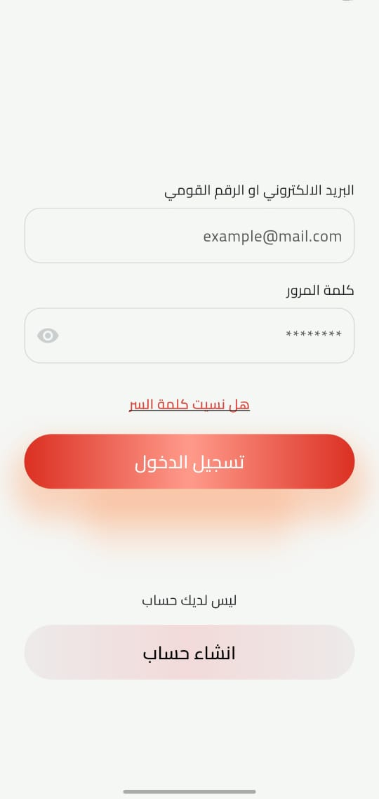<br />
      <strong>Sign In</strong>
    </td>
    <td align="center">
      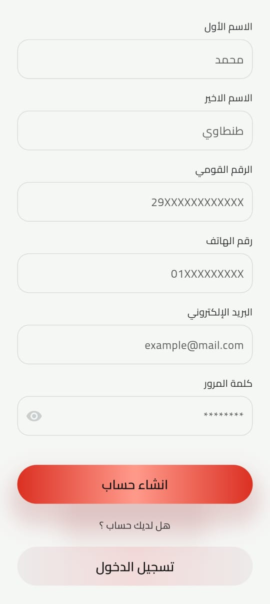<br />
      <strong>Register</strong>
    </td>
  </tr>
  <tr>
    <td align="center">
      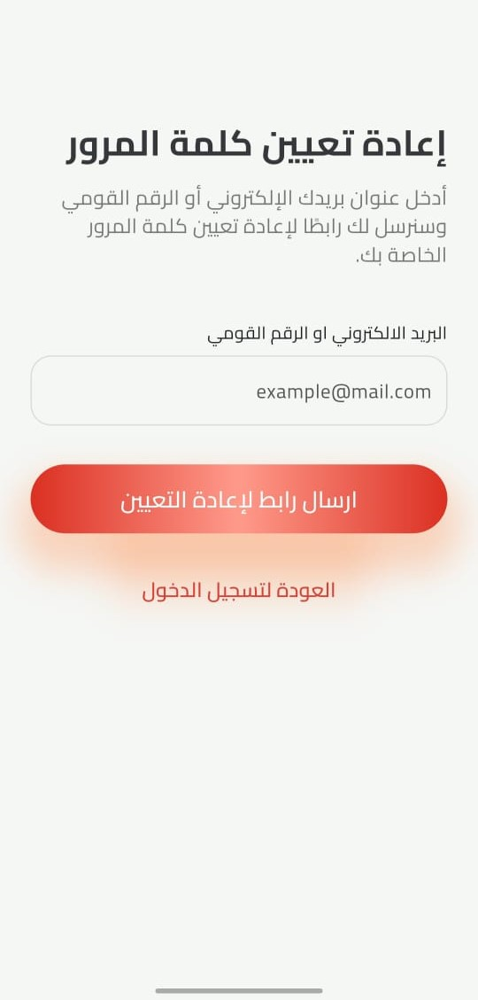<br />
      <strong>Reset Password</strong>
    </td>
    <td colspan="2"></td>
  </tr>
</table>

### Main Features

<table>
  <tr>
    <td align="center">
      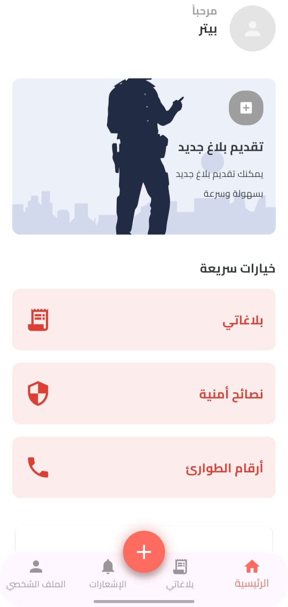<br />
      <strong>Home Screen</strong>
    </td>
    <td align="center">
      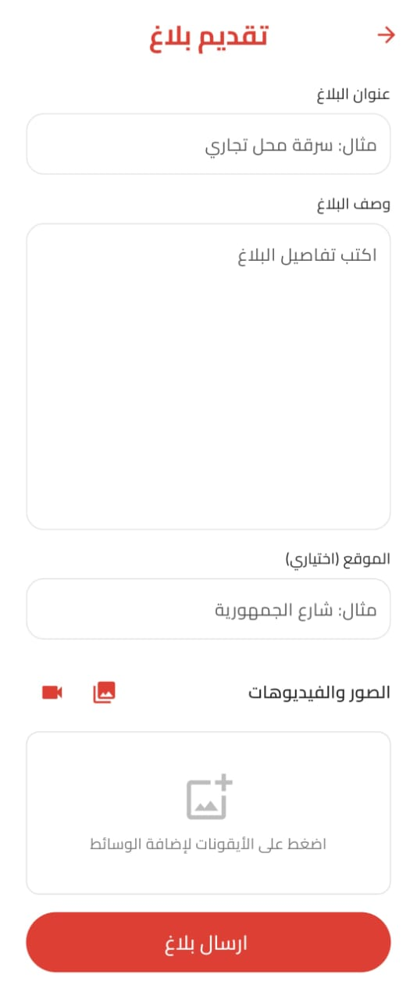<br />
      <strong>Add Report</strong>
    </td>
    <td align="center">
      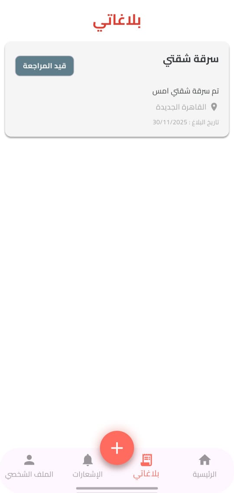<br />
      <strong>My Reports</strong>
    </td>
  </tr>
  <tr>
    <td align="center">
      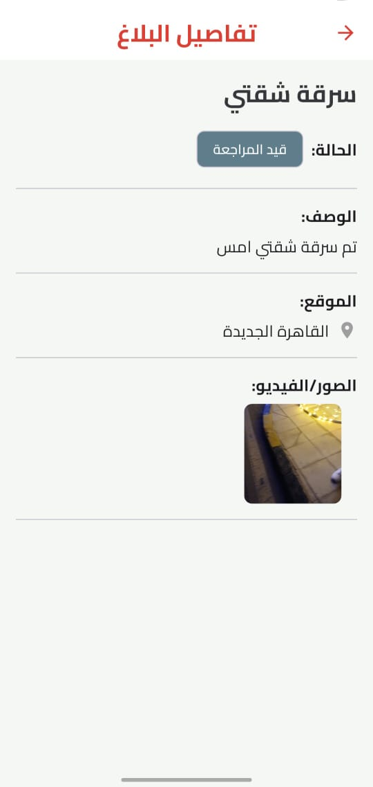<br />
      <strong>Report Details</strong>
    </td>
    <td align="center">
      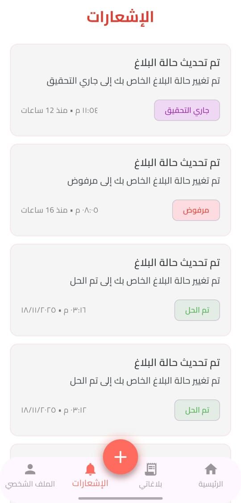<br />
      <strong>Notifications</strong>
    </td>
    <td align="center">
      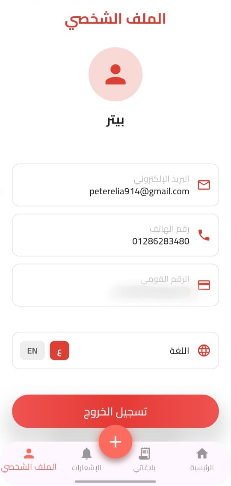<br />
      <strong>Profile</strong>
    </td>
  </tr>
</table>

### Emergency & Security

<table>
  <tr>
    <td align="center">
      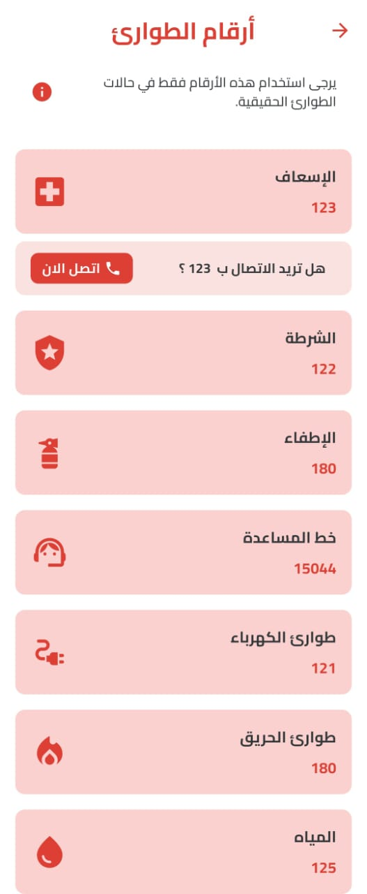<br />
      <strong>Emergency Numbers</strong>
    </td>
    <td align="center">
      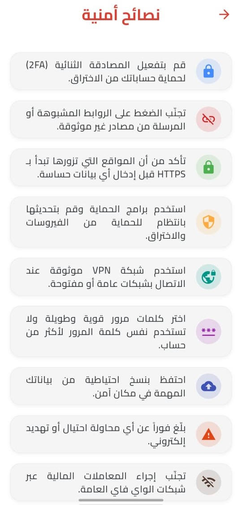<br />
      <strong>Security Tips</strong>
    </td>
    <td></td>
  </tr>
</table>

</div>

---

## 🏗️ Architecture

The project follows **Clean Architecture** principles with clear separation of concerns:

```
lib/
├── core/                    # Shared core functionality
│   ├── entities/           # Domain entities
│   ├── enums/              # Enumerations
│   ├── errors/             # Error handling
│   ├── helpers/            # Utility helpers
│   ├── models/             # Data models
│   ├── repos/              # Repository interfaces
│   ├── services/           # Services (Firebase, Cloudinary, etc.)
│   ├── utils/              # Utilities and constants
│   └── widgets/            # Reusable widgets
│
└── features/               # Feature modules
    ├── auth/               # Authentication
    │   ├── data/          # Data layer (repos, models)
    │   ├── domain/        # Domain layer (entities, repos)
    │   └── presentation/  # UI layer (views, widgets, cubits)
    │
    ├── add_report/        # Report submission
    ├── reports/           # Report management
    ├── notifications/     # Notifications
    ├── profile/           # User profile
    ├── emergency_numbers/ # Emergency services
    ├── home/              # Home dashboard
    └── splash/            # Splash screen
```

### Design Patterns Used
- **BLoC/Cubit Pattern**: State management using flutter_bloc
- **Repository Pattern**: Data abstraction layer
- **Dependency Injection**: Using get_it service locator
- **Observer Pattern**: Custom BLoC observer for debugging
- **Factory Pattern**: Model creation and parsing

---

## 🛠️ Tech Stack

### Frontend
- **Flutter 3.32.8**: Cross-platform mobile framework
- **Dart ^3.8.1**: Programming language

### State Management
- **flutter_bloc 9.1.1**: BLoC/Cubit state management
- **bloc 9.0.1**: Core BLoC library

### Backend Services
- **Firebase Core 4.2.0**: Firebase initialization
- **Firebase Auth 6.1.1**: Authentication
- **Cloud Firestore 6.0.3**: NoSQL database

### Storage & Media
- **Cloudinary**: Media storage and CDN
- **image_picker 1.2.0**: Image/video selection
- **video_thumbnail 0.5.6**: Video thumbnail generation

### UI & UX
- **flutter_screenutil 5.9.3**: Responsive design
- **animate_do 3.0.2**: Animations
- **lucide_icons 0.257.0**: Icon library
- **skeletonizer 2.1.0+1**: Skeleton loading screens
- **awesome_snackbar_content 0.1.7**: Beautiful snackbars
- **modal_progress_hud_nsn 0.5.1**: Loading overlays

### Utilities
- **shared_preferences 2.5.3**: Local storage
- **dio 5.9.0**: HTTP client
- **uuid 4.5.1**: Unique ID generation
- **flutter_phone_direct_caller 2.2.1**: Direct phone calling
- **flutter_dotenv 6.0.0**: Environment variables
- **dartz 0.10.1**: Functional programming
- **equatable 2.0.5**: Value equality

### Localization
- **flutter_localizations**: Internationalization support
- **intl**: Date/time formatting and localization

### Developer Tools
- **flutter_launcher_icons 0.14.4**: App icon generation
- **flutter_lints 5.0.0**: Linting rules

---

## 🚀 Getting Started

### Prerequisites
- Flutter SDK 3.32.8 or higher
- Dart SDK ^3.8.1
- Android Studio / Xcode (for mobile development)
- Firebase project with Authentication and Firestore enabled
- Cloudinary account for media storage

### Installation

1. **Clone the repository**
   ```bash
   git clone https://github.com/peterelia22/Aman-24.git
   cd Aman-24
   ```

2. **Install dependencies**
   ```bash
   flutter pub get
   ```

3. **Set up Firebase**
   - Create a Firebase project at [Firebase Console](https://console.firebase.google.com)
   - Enable Authentication (Email/Password)
   - Enable Cloud Firestore
   - Download and add configuration files:
     - `google-services.json` for Android → `android/app/`
     - `GoogleService-Info.plist` for iOS → `ios/Runner/`
   - Run FlutterFire configure:
     ```bash
     flutterfire configure
     ```

4. **Configure Cloudinary**
   - Create a `.env` file in the project root:
     ```env
     CLOUDINARY_CLOUD_NAME=your_cloud_name
     CLOUDINARY_UPLOAD_PRESET=your_upload_preset
     CLOUDINARY_API_KEY=your_api_key
     ```

5. **Generate app icons**
   ```bash
   flutter pub run flutter_launcher_icons
   ```

6. **Run the app**
   ```bash
   flutter run
   ```

### Building for Production

**Android APK:**
```bash
flutter build apk --release
```

**Android App Bundle:**
```bash
flutter build appbundle --release
```

**iOS:**
```bash
flutter build ios --release
```

---

## 📂 Project Structure

```
Aman-24/
├── .github/
│   └── workflows/           # CI/CD workflows
│       ├── firebase_deploy.yml
│       └── release.yml
│
├── android/                 # Android native code
├── ios/                     # iOS native code
├── web/                     # Web platform files
├── windows/                 # Windows platform files
├── linux/                   # Linux platform files
├── macos/                   # macOS platform files
│
├── assets/
│   ├── fonts/              # Custom fonts (Cairo)
│   └── images/             # App images and logo
│
├── lib/
│   ├── core/               # Core functionality
│   ├── features/           # Feature modules
│   ├── generated/          # Generated localization files
│   ├── l10n/              # Localization ARB files
│   ├── app_theme.dart     # App theme configuration
│   ├── constants.dart      # App constants
│   ├── firebase_options.dart
│   └── main.dart          # App entry point
│
├── test/                   # Unit and widget tests
├── .env                    # Environment variables (not in git)
├── .gitignore
├── analysis_options.yaml   # Linting rules
├── firebase.json           # Firebase configuration
├── pubspec.yaml           # Dependencies
└── README.md              # This file
```

---

## ⚙️ Configuration

### Firebase Configuration
The app uses Firebase for:
- **Authentication**: User sign-in/sign-up
- **Firestore**: Report and user data storage
- **Cloud Functions**: (Optional) for notifications

Configuration file: `lib/firebase_options.dart` (auto-generated)

### Cloudinary Configuration
Media files are stored on Cloudinary:
- **Images**: User-submitted evidence photos
- **Videos**: Video evidence with thumbnail generation

Required environment variables in `.env`:
```env
CLOUDINARY_CLOUD_NAME=your_cloud_name
CLOUDINARY_UPLOAD_PRESET=your_upload_preset
CLOUDINARY_API_KEY=your_api_key
```

### Theme Configuration
App theme is defined in `lib/app_theme.dart`:
- Primary color
- Secondary color
- Text styles
- Cairo font family

---

## 🔄 CI/CD Pipeline

The project includes GitHub Actions workflows for automated deployment:

### Firebase App Distribution
`.github/workflows/firebase_deploy.yml`
- Triggers on push to `main` branch
- Builds release APK
- Creates `.env` from GitHub secrets
- Distributes to Firebase App Distribution testers

### GitHub Releases
`.github/workflows/release.yml`
- Triggers on push to `main` branch
- Builds release APK
- Creates GitHub release with APK artifact
- Auto-increments version tags

### Required GitHub Secrets
```
CLOUDINARY_CLOUD_NAME
CLOUDINARY_UPLOAD_PRESET
CLOUDINARY_API_KEY
FIREBASE_APP_ID
FIREBASE_TOKEN
MY_GITHUB_TOKEN
```

---

## 🌍 Localization

The app supports **Arabic (RTL)** and **English (LTR)** with full localization.

### Adding New Translations

1. Edit ARB files in `lib/l10n/`:
   - `intl_en.arb` (English)
   - `intl_ar.arb` (Arabic)

2. Add new entries:
   ```json
   "key": "Translation text",
   "@key": {
     "description": "Description of usage"
   }
   ```

3. Generate localization code:
   ```bash
   flutter gen-l10n
   ```

4. Use in code:
   ```dart
   Text(S.of(context).key)
   ```

### Supported Languages
- 🇬🇧 English (en)
- 🇸🇦 Arabic (ar)

---

## 🤝 Contributing

We welcome contributions! Please follow these steps:

1. **Fork the repository**
2. **Create a feature branch**
   ```bash
   git checkout -b feature/AmazingFeature
   ```
3. **Commit your changes**
   ```bash
   git commit -m 'Add some AmazingFeature'
   ```
4. **Push to the branch**
   ```bash
   git push origin feature/AmazingFeature
   ```
5. **Open a Pull Request**

### Code Style
- Follow [Effective Dart](https://dart.dev/guides/language/effective-dart) guidelines
- Run `flutter analyze` before committing
- Format code with `dart format .`
- Write meaningful commit messages

---

## 👥 Team

**Team DEPI**

- **Project Repository**: [Aman-24](https://github.com/peterelia22/Aman-24)
- **Organization**: DEPI (Digital Egypt Pioneers Initiative)

---

## 📄 License

This project is licensed under the MIT License - see the [LICENSE](LICENSE) file for details.

---

## 📞 Support

For support, please:
- 🐛 Open an issue on [GitHub](https://github.com/peterelia22/Aman-24/issues)
- 📚 Check the documentation in this README

---

## 🙏 Acknowledgments

- Flutter team for the amazing framework
- Firebase for backend services
- Cloudinary for media storage
- All open-source contributors
- DEPI program for support and guidance

---

<div align="center">
  <p>Made with ❤️ by Team DEPI</p>
  <p>© 2025 Aman-24. All rights reserved.</p>
</div>
